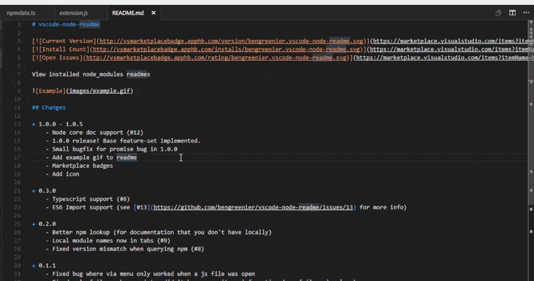

# vscode-node-readme

View installed node_modules readmes

## Changes

+ 1.0.0 - 1.0.4
    - Node core doc support (#12)
    - 1.0.0 release! Base feature-set implemented.
    - Small bugfix for promise bug in 1.0.0
    - Add example gif to readme
    - Marketplace badges

+ 0.3.0
    - Typescript support (#6)
    - ES6 Import support (see [#13](https://github.com/bengreenier/vscode-node-readme/issues/13) for more info)

+ 0.2.0
    - Better npm lookup (for documentation that you don't have locally)
    - Local module names now in tabs (#9)
    - Fixed version mismatch when querying npm (#8)

+ 0.1.1
    - Fixed bug where via menu only worked when a js file was open
    - Fixed ugly failure when registry didn't have repository information (now failure is clear)

+ 0.1.0
    - Support for menu command
    - Support for documentation from npmjs.org
    - Better command name

## Features

Quickly open `node_modules` readme files.

### Inline

+ Right click a `require('moduleName')` call in a `js` or `ts` file
+ Select `View Node Module Readme`

### Via Menu

+ Open Menu (`Ctrl+Shift+P` by default on windows)
+ Type `View Node Module Readme`
+ If you have a module highlighted we'll go to that
+ If you do not, we'll prompt for a module name

## Issues?

File them [here](https://github.com/bengreenier/vscode-node-readme/issues). Feel free to contribute code, if you're a developer.

## License

MIT